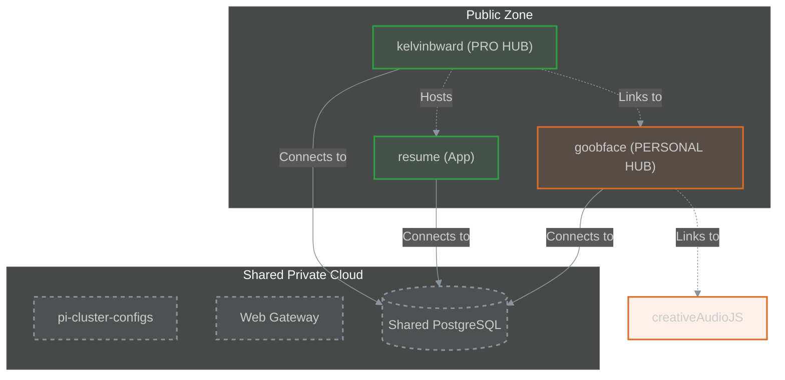

# Kelvin B. Ward

Welcome to the central hub of my digital presence. This repository operates as a **Federated System Hub**, distinctively separating my professional engineering work from my personal creative experiments.

## 🎯 Choose Your Path

| [**Professional Portfolio**](https://www.kelvinbward.com) | [**Personal Sandbox**](https://www.goobface.com) |
| :--- | :--- |
| **Focus**: Full-Stack Engineering, Cloud Architecture, Leadership | **Focus**: Game Dev, 3D Printing, Generative Audio |
| **Tech**: Next.js, React, TailwindCSS, PostgreSQL | **Tech**: Astro, Phaser.js, Three.js, Tone.js |
| [📂 View Source](https://github.com/kelvinbward/kelvinbward) | [📂 View Source](https://github.com/kelvinbward/goobface) |

---

## 🏗 System Architecture

The ecosystem implements a **"Dual Hub" Federated Architecture**, allowing strict separation of concerns while sharing foundational infrastructure.



## 📚 Repository Map

| Repository | Tech Stack | Role | Status |
| :--- | :--- | :--- | :--- |
| **[kelvinbward](https://github.com/kelvinbward/kelvinbward)** | Next.js / TypeScript | **Professional Hub**. The entry point and engineering blog. | - |
| **[resume](https://github.com/kelvinbward/resume)** | Vue.js / Node.js | **Professional App**. Interactive resume application. | [Live](https://www.kelvinbward.com/resume/) |
| **[goobface](https://github.com/kelvinbward/goobface)** | Astro / Phaser | **Creative Hub**. Game showcase & 3D printing blog. | [Live](https://www.goobface.com) |
| **[creativeAudioJS](https://github.com/kelvinbward/creativeAudioJS)** | Vanilla JS / Tone.js | **Experiment**. Audio synthesis playground (Referenced by Goobface). | [Demo](https://kelvinbward.github.io/creativeAudioJS) |
| **[pi-cluster-configs](https://github.com/kelvinbward/pi-cluster-configs)** | Ansible / Docker | **Engine Room**. Infrastructure configuration. | Internal |

## 🚀 Execution Modes

This Hub supports multiple modes of operation to ensure flexibility across development, standalone hosting, and cluster integration.

| Mode | Command | Context |
| :--- | :--- | :--- |
| **Dev** | `npm run dev` | Local development with hot-reload. |
| **Standalone** | `docker compose -f docker-compose.standalone.yml up` | Self-contained Nginx container exposing port 8080. |
| **Cluster** | `docker compose up` | Integrating with `web_gateway` network (requires `pi-cluster-configs`). |
| **Static** | `npm run build` | GitHub Pages deployment (Static HTML Export). |

### Bootstrap Your Own Private Cloud
To run the full "Cluster Mode", you must first bootstrap the shared infrastructure:
```bash
# Clone the infrastructure config
git clone https://github.com/kelvinbward/pi-cluster-configs ../pi-cluster-configs

# Start the Gateway and Database
cd ../pi-cluster-configs
docker compose up -d
```

## 🛡️ Security & Governance

The integrity of this ecosystem is maintained through a "Defense in Depth" strategy.

*   **Code Ownership**: Critical infrastructure files are protected by `CODEOWNERS`.
*   **Agent Protocol**: All automated agents must strictly follow [AGENTS.md](./AGENTS.md).
*   **Branch Protection**: Direct pushes to `main` are restricted. All changes require PRs with passing build checks.
