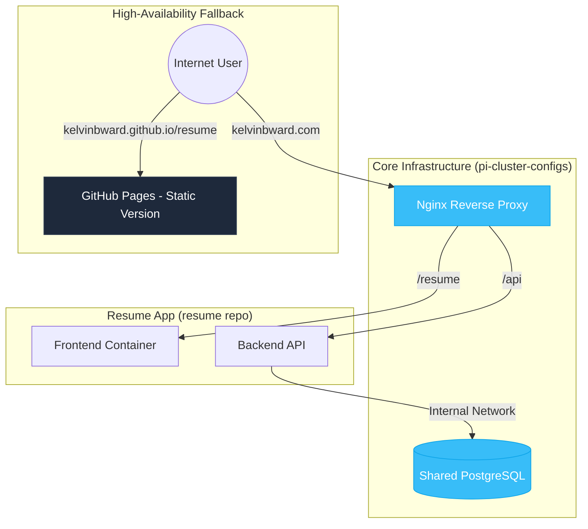

# 🏛️ Kelvin Ward | Cloud Architect & ServiceNow Developer
> "Enterprise solutions at scale; personal projects at the edge."

## 📍 System Architecture: The Personal Cloud
This repository serves as the **Design Document** and **Control Plane** for my Raspberry Pi 5 micro-service cluster. 

## 🤖 AI Agent Protocol
This repository enables agentic workflows via the **`AGENTS.md`** file.
- **Local Context**: `AGENTS.md` in this folder defines the project's specific role and config.
- **Global Context**: The Root `AGENTS.md` (in the workspace root) maps the entire polyrepo ecosystem.
**Rule**: AI agents must update these files after architectural changes to maintain self-documentation.

### 🏗️ Current Framework: Phase 1 (Foundations)
I am currently transitioning from a standalone resume to a **Polyrepo Gateway** architecture. This setup allows me to host dynamic, database-driven applications on my home lab while maintaining 100% uptime through static fallbacks.

### 🏗️ Conceptual Architecture
This diagram represents the Service Discovery and Polyrepo mapping for my Raspberry Pi 5 micro-service cluster.

- **Status**: 🟢 Design Phase / 🟡 Cluster In-Progress
- **Host**: Raspberry Pi 5 (8GB)
- **Orchestration**: Docker & Nginx Reverse Proxy (Polyrepo)

### 🔄 Workflow
The infrastructure is split into a **Provider** (pi-cluster-configs) and **Consumers** (functional apps like `resume`).
1.  **Core Services**: The `pi-cluster-configs` repo defines the shared `web_gateway` network and central `resume-db-1`.
2.  **App deployment**: The `resume` app attaches to the pre-existing `web_gateway` network and connects to the shared DB using the stable hostname `resume-db-1`.
3.  **Routing**: The Gateway proxies requests to the appropriate app containers via Docker internal DNS.

### 📂 Repository Showcase
| Project | Role | Tech Stack | Status |
| :--- | :--- | :--- | :--- |
| [Resume](https://github.com/kelvinbward/resume) | Full-Stack App | Node.js, PostgreSQL, Nginx | [Live Demo](https://kelvinbward.github.io/resume/) |
| [Infra (Private)](https://github.com/kelvinbward/pi-cluster-configs) | Gateway Config | Docker Compose, YAML | Secure Vault |

### 🛠️ Building Your Own Private Cloud
For those interested in replicating this **Polyrepo Provider/Consumer** pattern, here is the blueprint:

#### 1. The Provider Repo (`pi-cluster-configs`)
This private repository holds the keys to the castle.
- **Gateway**: Defines an external bridge network (e.g., `web_gateway`).
- **Core Services**: Hosts shared databases (Postgres, Redis) attached to this network.
- **Secrets**: `.env` files and certificates are stored here, never in app repos.

#### 2. The Consumer Repos (e.g., `resume`)
Public application repositories that are unaware of the underlying hardware.
- **Network**: Configured with `external: true` to attach to `web_gateway`.
- **Config**: Connects to services via stable container names (e.g., `DB_HOST=resume-db-1`).
- **Standalone Mode**: Includes a `docker-compose.standalone.yml` that mocks the shared infra for public users.

## 🤝 Contributing & Feedback
I treat my personal infrastructure like an open-source enterprise project.
1. **Explore**: View my [Architecture Blueprint](#) (Link to your diagram).
2. **Connect**: Reach out for collaborations on [LinkedIn](https://www.linkedin.com/in/kelvinbward/).
