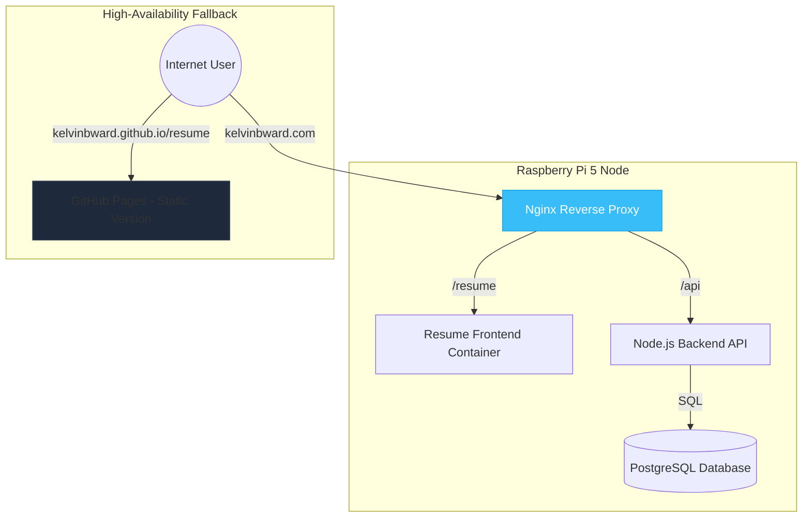

# 🏛️ Kelvin Ward | Cloud Architect & ServiceNow Developer
> "Enterprise solutions at scale; personal projects at the edge."

## 📍 System Architecture: The Personal Cloud
This repository serves as the **Design Document** and **Control Plane** for my Raspberry Pi 5 micro-service cluster. 

### 🏗️ Current Framework: Phase 1 (Foundations)
I am currently transitioning from a standalone resume to a **Polyrepo Gateway** architecture. This setup allows me to host dynamic, database-driven applications on my home lab while maintaining 100% uptime through static fallbacks.

### 🏗️ Conceptual Architecture
This diagram represents the foundational mapping for my Raspberry Pi 5 micro-service cluster.

- **Status**: 🟢 Design Phase / 🟡 Cluster In-Progress
- **Host**: Raspberry Pi 5 (8GB)
- **Orchestration**: Docker & Nginx Reverse Proxy

### 📂 Repository Showcase
| Project | Role | Tech Stack | Status |
| :--- | :--- | :--- | :--- |
| [Resume](https://github.com/kelvinbward/resume) | Full-Stack App | Node.js, PostgreSQL, Nginx | [Live Demo](https://kelvinbward.github.io/resume/) |
| [Infra (Private)](https://github.com/kelvinbward/pi-cluster-configs) | Gateway Config | Docker Compose, YAML | Secure Vault |

## 🤝 Contributing & Feedback
I treat my personal infrastructure like an open-source enterprise project.
1. **Explore**: View my [Architecture Blueprint](#) (Link to your diagram).
2. **Connect**: Reach out for collaborations on [LinkedIn](https://www.linkedin.com/in/kelvinbward/).
