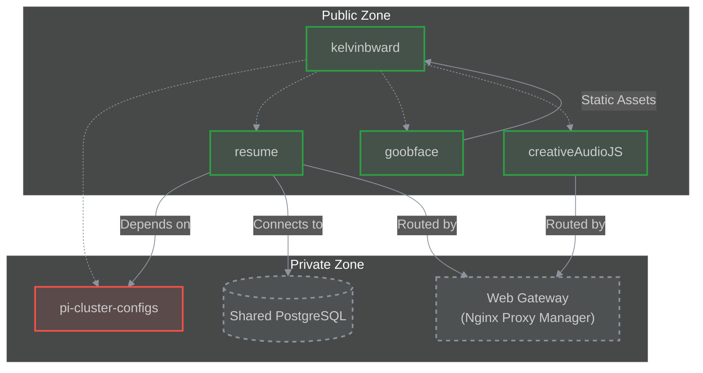

# Kelvin Ward

Welcome to my personal monorepo-style polyrepo setup. This repository (`kelvinbward`) acts as the public face and documentation hub for my ecosystem of projects.

## 🏗 System Architecture

The following diagram illustrates the relationship between the various repositories and services in my "Personal Cloud":

## 📚 Repositories

| Repository | Visibility | Role | Status |
| :--- | :--- | :--- | :--- |
| **[kelvinbward](https://github.com/kelvinbward/kelvinbward)** | Public | **Root & Profile**. Documentation hub and static site. | - |
| **[resume](https://github.com/kelvinbward/resume)** | Public | Full-stack Vue.js/Node.js application. | [Live](https://www.kelvinbward.com) |
| **[goobface](https://github.com/kelvinbward/goobface)** | Public | Game showcase (Astro/Phaser). | [Live](https://www.goobface.com) |
| **[creativeAudioJS](https://github.com/kelvinbward/creativeAudioJS)** | Public | Audio experiments (Tone.js). | [Demo](https://kelvinbward.github.io/creativeAudioJS) |
| **[pi-cluster-configs](https://github.com/kelvinbward/pi-cluster-configs)** | Private | Infrastructure configuration (Nginx, DB). | Internal |

## 🚀 Getting Started

Please refer to [AGENTS.md](./AGENTS.md) for the "Root" architecture documentation and contribution guidelines.
