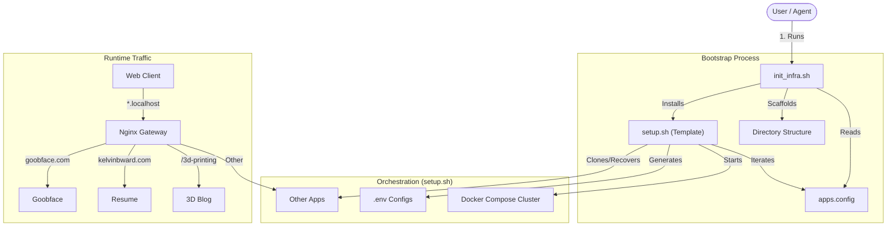

# Kelvin B. Ward

Welcome to the central hub of my digital presence. This repository operates as a **Federated System Hub**, distinctively separating my professional engineering work from my personal creative experiments.

## 🎯 Choose Your Path

| [**Professional Portfolio**](https://www.kelvinbward.com) | [**Personal Sandbox**](https://www.goobface.com) |
| :--- | :--- |
| **Focus**: Full-Stack Engineering, Cloud Architecture, Leadership | **Focus**: Game Dev, 3D Printing, Generative Audio |
| **Tech**: Next.js, React, TailwindCSS, PostgreSQL | **Tech**: Astro, Phaser.js, Three.js, Tone.js |
| [📂 View Source](https://github.com/kelvinbward/kelvinbward) | [📂 View Source](https://github.com/kelvinbward/goobface) |

---

## 🏗 System Architecture & Bootstrap Flow

The ecosystem follows a **Registry-Driven** bootstrap process. The `apps.config` registry acts as the single source of truth for all active modules.



## 📡 Service Discovery & Registry

| Service | Internal Host | Port | Mode |
| :--- | :--- | :--- | :--- |
| **KELVINBWARD** | `kelvinbward-app-1` | `3000` | cluster |
| **MIDDLEWARE** | `middleware-app-1` | `5000` | cluster |
| **RESUME** | `resume-frontend-1` | `80` | gitops |
| **GOOBFACE** | `goobface-app-1` | `4321` | cluster |
| **CREATIVEAUDIOJS** | `creative-audio-1` | `5173` | cluster |

## 🤖 Agent Hand-off
**Starting a new task?**
1.  **Read Protocol**: Review [AGENTS.md](./AGENTS.md) for the latest rules.
2.  **Check Registry**: Inspect `apps.config` in `pi-cluster-configs` to understand active services.
3.  **Branching**: Create `feature/<name>` or `fix/<name>`.
4.  **Sync State**: Generate `STATE.md` before PR validation.

## 🚀 Execution Modes

This Hub supports multiple modes of operation to ensure flexibility across development, standalone hosting, and cluster integration.

| Mode | Command | Context |
| :--- | :--- | :--- |
| **Dev** | `npm run dev` | Local development with hot-reload. |
| **Standalone** | `docker compose -f docker-compose.standalone.yml up` | Self-contained Nginx container exposing port 8080. |
| **Cluster** | `docker compose up` | Integrating with `web_gateway` network (requires `pi-cluster-configs`). |
| **Static** | `npm run build` | GitHub Pages deployment (Static HTML Export). |

### Bootstrap Your Own Private Cloud
To run the full "Cluster Mode", you can bootstrap a fresh `pi-cluster-configs` setup matching the production architecture:

```bash
# Initialize infrastructure
./scripts/init_infra.sh
```

## 🛡️ Security & Governance

The integrity of this ecosystem is maintained through a "Defense in Depth" strategy.

*   **Code Ownership**: Critical infrastructure files are protected by `CODEOWNERS`.
*   **Agent Protocol**: All automated agents must strictly follow [AGENTS.md](./AGENTS.md), including:
    *   **Branch Naming**: `feature/`, `fix/`, `infra/`.
    *   **PR Generation**: Agents must currently generate local branches for review.
    *   **Cleanup**: Automatic deletion of slate environment branches.
*   **Branch Protection**: Direct pushes to `main` are restricted. All changes require PRs with passing build checks.
*   **Secret Management**: No secrets in repo. Environment variables managed via `pi-cluster-configs`.
*   **Immutable Public Directory**: The `/public/` directory is strictly managed.
    *   **Rule**: Modifications to `public/[app]/` must be generated by CI/CD workflows (`github-actions[bot]`).
    *   **Enforcement**: Manual changes by human users are blocked by `guard-immutable.yml` to prevent deployment drift.

## 🧠 Architectural Decisions

### Pattern: Hybrid-Mono Repository
This ecosystem uses a **Hybrid-Mono** pattern to balance Open Source portfolio constraints with production security.

-   **Public Repositories** (`middleware`, `resume`):
    -   Serve as "Products".
    -   Contain source code, tests, and standard Dockerfiles.
    -   **Goal**: Demonstrate engineering capability publicly.
    
-   **Private Repository** (`pi-cluster-configs`):
    -   Serves as the "Environment".
    -   Contains orchestrator scripts (`setup.sh`), secrets (`.env`), and runtime configuration.
    -   **Goal**: Securely manage deployment logic.

-   **The Bridge**:
    -   The `setup.sh` orchestrator **clones** public repositories into the private infrastructure.
    -   This effectively treats public repos as dynamic "modules" managed via script, maintaining clear separation of source (public) and state (private).
