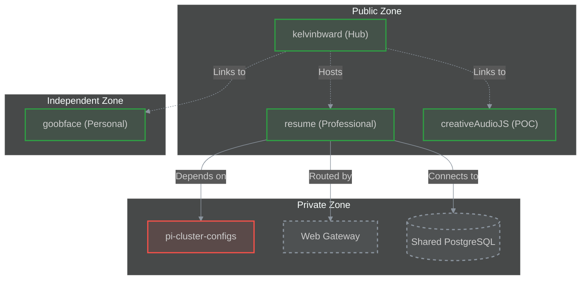

# Kelvin B. Ward

Welcome to the central hub of my digital presence. This repository operates as a **Hybrid-Mono** system, distinctively separating my professional engineering work from my personal creative experiments.

## 🎯 Choose Your Path

| [**Professional Portfolio**](https://www.kelvinbward.com) | [**Personal Sandbox**](https://www.goobface.com) |
| :--- | :--- |
| **Focus**: Full-Stack Engineering, Cloud Architecture, Leadership | **Focus**: Game Dev, 3D Printing, Generative Audio |
| **Tech**: Vue.js, Node.js, PostgreSQL, Docker | **Tech**: Astro, Phaser.js, Three.js, Tone.js |
| [📂 View Source](https://github.com/kelvinbward/resume) | [📂 View Source](https://github.com/kelvinbward/goobface) |

---

## 🏗 System Architecture

The following diagram illustrates the relationship between the various repositories and services in my "Personal Cloud":



## 📚 Repository Map

| Repository | Visibility | Role | Status |
| :--- | :--- | :--- | :--- |
| **[kelvinbward](https://github.com/kelvinbward/kelvinbward)** | Public | **System Hub**. The entry point and documentation root. | - |
| **[resume](https://github.com/kelvinbward/resume)** | Public | **Professional Node**. Full-stack Vue.js/Node.js application. | [Live](https://www.kelvinbward.com) |
| **[goobface](https://github.com/kelvinbward/goobface)** | Public | **Creative Node**. Game showcase & 3D printing blog. | [Live](https://www.goobface.com) |
| **[creativeAudioJS](https://github.com/kelvinbward/creativeAudioJS)** | Public | **Experiment Node**. Audio synthesis playground. | [Demo](https://kelvinbward.github.io/creativeAudioJS) |
| **[pi-cluster-configs](https://github.com/kelvinbward/pi-cluster-configs)** | Private | **Engine Room**. Infrastructure configuration (Nginx, DB). | Internal |

## 🌐 Deployment & Domain Strategy
This architecture uses a **"Hybrid-Mono"** deployment model where `kelvinbward` acts as the single public entry point.

| Component | Repository | Deployment Path |
| :--- | :--- | :--- |
| **Hub** | `kelvinbward` | Root (`/`) |
| **Resume** | `resume` | Subpath (`/resume/`) &rarr; *Merged into Hub* |
| **Goobface** | `goobface` | Standalone (`goobface.com`) &rarr; *Linked only* |

### Domain Configuration
*   **Hub Domain**: `kelvinbward.com` serves the Hub and the `resume` app.
*   **Goobface Domain**: `goobface.com` serves the `goobface` app independently.
*   **Resume**: Does **NOT** need a custom domain; it is deployed directly into the Hub's `gh-pages`.

## 🚀 Getting Started

Since this architecture splits public code from private infrastructure, you need to spin up a local "Private Cloud" to run the applications fully.

### Bootstrap Your Own Private Cloud
I have included a script to bootstrap the necessary infrastructure (Nginx Proxy Manager + PostgreSQL) locally.

1.  **Run the Bootstrapper**:
    ```bash
    ./scripts/init_infra.sh
    ```
    This will create a `../pi-cluster-configs` directory and generate the necessary Docker Compose files.

2.  **Start Services**:
    Follow the output instructions from the script to start the Gateway and Database.

3.  **Run Apps**:
    You can now go to `resume/` or `goobface/` and run them—they will be able to connect to the shared database and network.

Please refer to [AGENTS.md](./AGENTS.md) for the "Root" architecture documentation and contribution guidelines.
